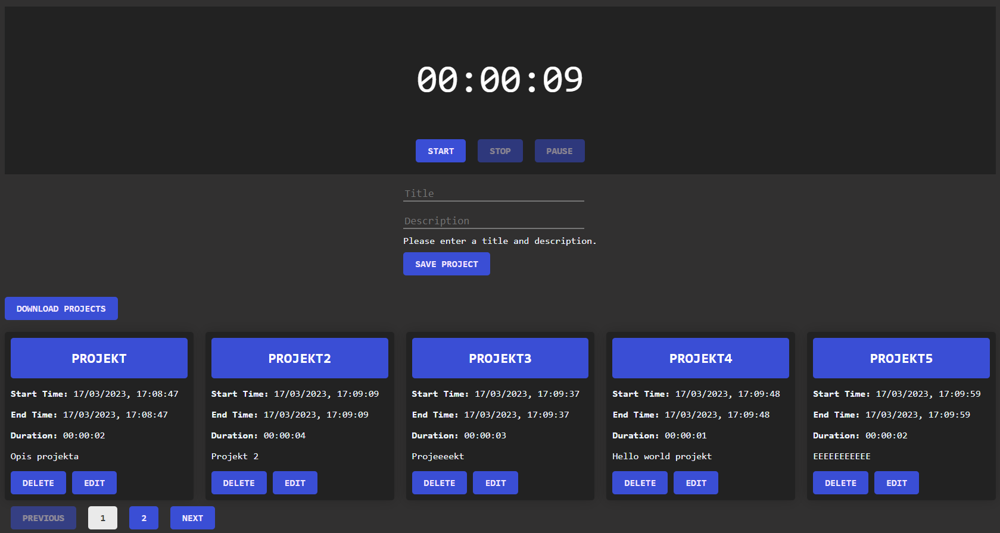

# Timely

This code is a full-stack application that allows users to create, view, update and delete projects with a timer component in Angular.

The back-end of the application is developed with Node.js, Express.js, and uses a JSON file to store project data. The back-end provides an API to perform CRUD operations on project data.

The front-end of the application is developed with Angular and provides a user interface to interact with the back-end API. The timer component allows users to start and stop a timer, and save the elapsed time as the duration of a project.

The application has pagination functionality to display the projects in pages, and also allows users to export the project data as an Excel file.

Overall, this is a simple CRUD application with basic functionality.

# Image

